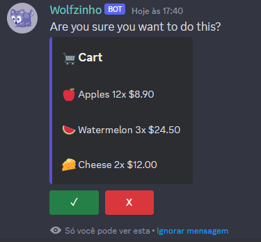

# Magicyan Discord +

Install with
```bash
npm install @magicyan/discord-plus
```

Easy interactions in discord

## Prompts

Confirm prompt
```ts
// Slash command scope ...
const { user } = interaction;

// Example embed
const embed = new EmbedBuilder({
    title: "🛒 Cart",
    fields: [
        { name: "\u200b", value: "🍎 Apples 12x $8.90" },
        { name: "\u200b", value: "🍉 Watermelon 3x $24.50" },
        { name: "\u200b", value: "🧀 Cheese 2x $12.00" }
    ]
})

ConfirmPrompt({
    executor: user,
    render(components) {
        return interaction.reply({
            ephemeral: true, fetchReply: true,
            embeds: [embed],
            content: "Are you sure you want to do this?",
            components
        })
    },
    onCancel(interaction) {
        interaction.update({
            components: [], embeds: [],
            content: "You canceled this operation!"
        })
    },
    onConfirm(interaction) {
        interaction.update({
            components: [], embeds: [],
            content: "Order placed successfully!"
        })  
    },
})
```


The confirm button is clicked

