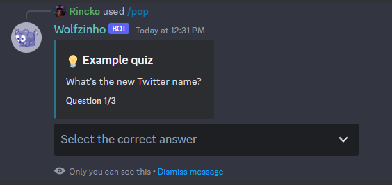
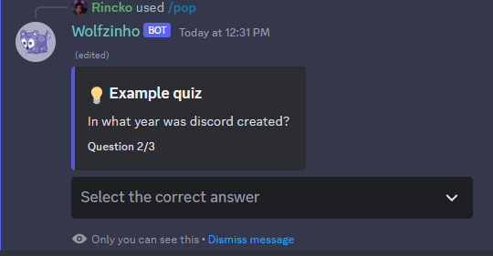
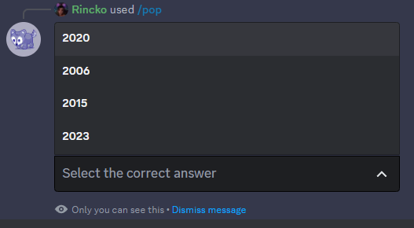
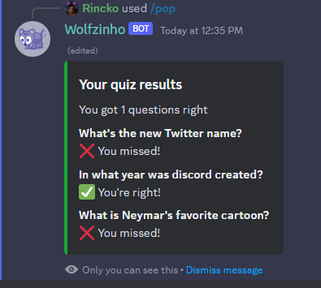

# Magicyan Discord +

Install with
```bash
npm install @magicyan/discord-plus
```

Easy interactions in discord

## Prompts

Confirm prompt
```ts
// Slash command scope ...
const { user } = interaction;

// Example embed
const embed = new EmbedBuilder({
    title: "🛒 Cart",
    fields: [
        { name: "\u200b", value: "🍎 Apples 12x $8.90" },
        { name: "\u200b", value: "🍉 Watermelon 3x $24.50" },
        { name: "\u200b", value: "🧀 Cheese 2x $12.00" }
    ]
})

ConfirmPrompt({
    executor: user,
    render(components) {
        return interaction.reply({
            ephemeral: true, fetchReply: true,
            embeds: [embed],
            content: "Are you sure you want to do this?",
            components
        })
    },
    onCancel(interaction) {
        interaction.update({
            components: [], embeds: [],
            content: "You canceled this operation!"
        })
    },
    onConfirm(interaction) {
        interaction.update({
            components: [], embeds: [],
            content: "Order placed successfully!"
        })  
    },
})
```


The confirm button is clicked


Quiz Prompt
```json
// questions.json
[
    {
        "color": 203050,
        "description": "What's the new Twitter name?",
        "options":[
            { "label": "birder", "value": "incorrect-01" },
            { "label": "X", "value": "correct" },
            { "label": "rio", "value": "incorrect-02" },
            { "label": "Twintter", "value": "incorrect-03" }
        ]
    },
    {
        "color": 604090,
        "description": "In what year was discord created?",
        "options":[
            { "label": "2020", "value": "incorrect-01" },
            { "label": "2006", "value": "incorrect-02" },
            { "label": "2015", "value": "correct" },
            { "label": "2023", "value": "incorrect-03" }
        ]
    },
    {
        "color": 503090,
        "description": "What is Neymar's favorite cartoon?",
        "options":[
            { "label": "Adventure time", "value": "incorrect-01" },
            { "label": "Regular show", "value": "incorrect-02" },
            { "label": "Reality collapses", "value": "correct" },
            { "label": "Ben 10", "value": "incorrect-03" }
        ]
    }
]
```
```ts
import questions from "./questions.json";

// Slash command scope ...
QuizPrompt({
    executor: interaction.user,
    questions: questions.map(
        ({ color, description, options }) => ({
            embed: new EmbedBuilder({
                title: "💡 Example quiz",
                color: parseInt(color, 16),
                description: description,
            }),
            placeholder: "Select the correct response",
            options,
        })
    ),
    render(embed, components) {
        return interaction.reply({
            ephemeral: true, fetchReply: true,
            embeds: [embed],
            components
        })
    },
    onEnd(interaction, results) {
        const rightAnswers = results.filter(r => r == "correct").length;

        const fields = results.map((result, index) => {
            const isCorrect = result == "correct";
            return {
                name: questions[index].description,
                value: isCorrect ? "✅ You're right!" : "❌ You missed!"
            }
        })

        const embed = new EmbedBuilder({
            title: "Your quiz results",
            color: parseInt("17a636", 16),
            description: `You got ${rightAnswers} questions right`,
            fields,
        })

        interaction.update({
            embeds: [embed],
            components: [], 
        })
    },
})
```






