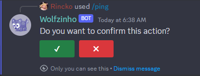
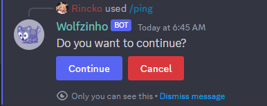
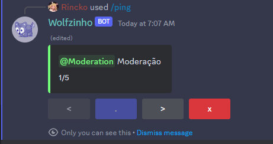
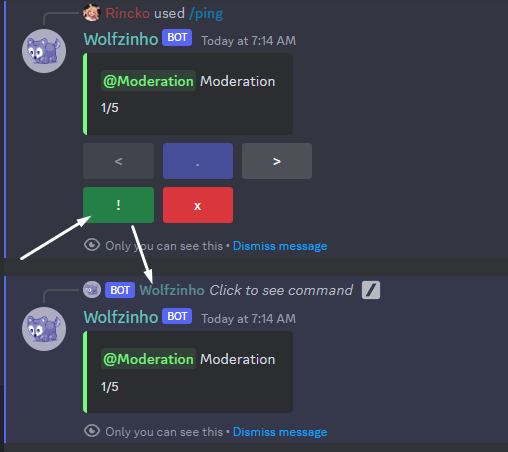

<div align="center">
  
  <div style="margin-left: 20px;">

  # Magicyan Discord Ui
  
  </div>
</div>

Install with
```bash
npm install @magicyan/discord-ui
pnpm install @magicyan/discord-ui
yarn add @magicyan/discord-ui
bun install @magicyan/discord-ui
```

> This lib provides customized "components" for your discord bot, see how to use it:

## Get started
- You can customize the buttons for all components of this lib using the discordUi function in your index file

```ts
import { discordUi } from "@magicyan/discord-ui";

discordUi({
  prompts: {
    confirm: {
      buttons: {
        confirm: { label: "Confirm", style: ButtonStyle.Success },
        cancel: { label: "Cancel", style: ButtonStyle.Secondary }
      }
    }
  },
  menus: {
    pagination: {
      buttons: {
        previous: { style: ButtonStyle.Danger },
        home: { label: "Home", emoji: "🏠" },
        next: { label: "Next", style: ButtonStyle.Success },
        close: { emoji: "❌" }
      }
    }
  }
});
```
- This is applied to all components, but is overridden by customization in the component function itself if defined

## Prompts

### Confirm prompt

- Easily create a component that waits for user confirmation

```ts
import { confirm } from "@magicyan/discord-ui";

confirm({
  components: ({ confirm, cancel }) => [
    new ActionRowBuilder({ components: [confirm, cancel] })
  ],
  render: components => interaction.reply({ 
    ephemeral: true, fetchReply: true, components,
    content: "Do you want to confirm this action?" 
  }),
  async onClick(interaction, isCancel) {
    await interaction.update({ components: [] });
    if (isCancel){
      interaction.editReply({ content: "This action has been canceled" });
      return;
    }
    interaction.editReply({ content: "Confirmed!" });
  },
});
```


- You can customize the buttons
```ts
confirm({
  // ...
  buttons: {
    confirm: { label: "Continue", style: ButtonStyle.Primary },
    cancel: { label: "Cancel" },
  },
  render: components => interaction.reply({ 
    ephemeral: true, fetchReply: true, components,
    content: "Do you want to continue?" 
  })
});
```


- You can specify a timeout and a function that will run when the time is up
```ts
confirm({
  // ...
  time: 60000,
  onTimeout() {
    interaction.editReply({ 
      content: "Time's up", 
      components: [] 
    });
  },
});
```

- It is important that the **render** method receives a message, so if you are replying to interactions, set **fetchReply** to true
- This prompt uses a discord collector, it will remain active until one of the buttons is clicked or the timeout
-You can use the filter method if you are not sending ephemeral messages (it is the same as the discord component collector)

## Menus

### Pagination menu

- This is a menu of embeds with pages, you just need to pass an array of embeds that you want to display

```ts
import { pagination } from "@magicyan/discord-ui";

pagination({
  embeds: [embed1, embed2, embed3],
  components: ({ home, close, next, previous }) => [
    new ActionRowBuilder<ButtonBuilder>({
        components: [previous, home, next, close]
    })
  ],
  render: (embed, components) => interaction.reply({ 
      fetchReply: true, ephemeral: true, embeds:[embed], components 
  }),
  onClick(interaction, embed) {
      interaction.reply({ ephemeral: true, embeds: [embed] });
  }
});
```
- Working smart, try to map out whatever list structure you have

```ts
const roles = Array.from(interaction.member.roles.cache.values());

pagination({
  // ...
  embeds: roles.map((role, index) => new EmbedBuilder({
    description: `${role} ${role.name}`,
    color: role.color,
    footer: { text: `${index+1}/${roles.size}` }
  })),
});
```



- Use the buttons to move forward and backward through the pages
- You can customize each individual button using the buttons property
- It uses a discord component collector, so you can pass a filter, a timeout and a function for when the time is up

- You can set an action button if you want, along with its function, which when executed, does not change the pages but returns the embed of the current page for you to do whatever you want.

```ts

pagination({
  // ...
  components: ({ action, close, ...buttons }) => [
    new ActionRowBuilder<ButtonBuilder>({
        components: [...Object.values(buttons)]
    }),
    new ActionRowBuilder<ButtonBuilder>({
        components: [action, close]
    })
  ],
  // ...
  onClick(interaction, embed){
    interaction.reply({ ephemeral: true, embeds: [embed] })
  }
});
```



- The close button causes the message to be deleted, but you can do whatever you want by defining the onClose method
```ts
pagination({
  // ...
  onClose(interaction){
    interaction.update({ 
      components: [], embeds: [], 
      content: "Closed" 
    })
  }
});
```